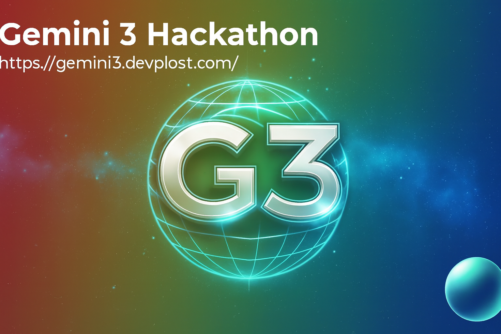
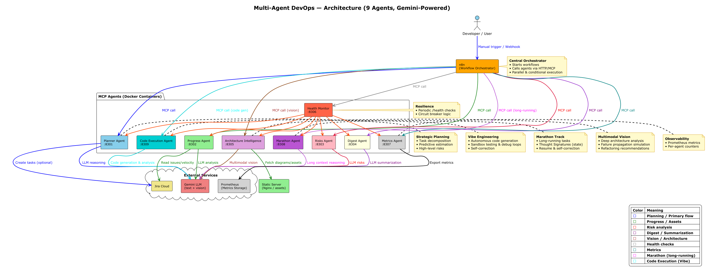
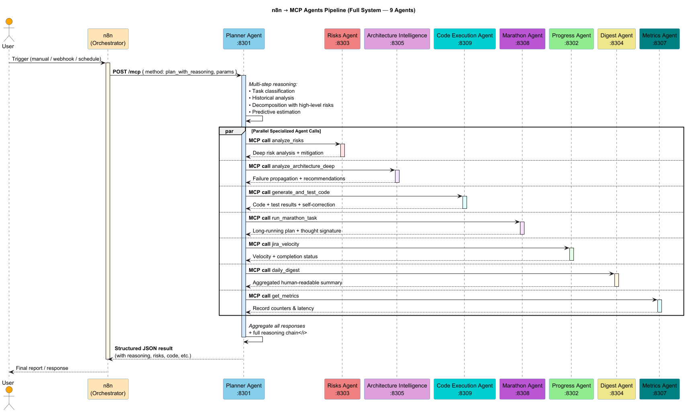
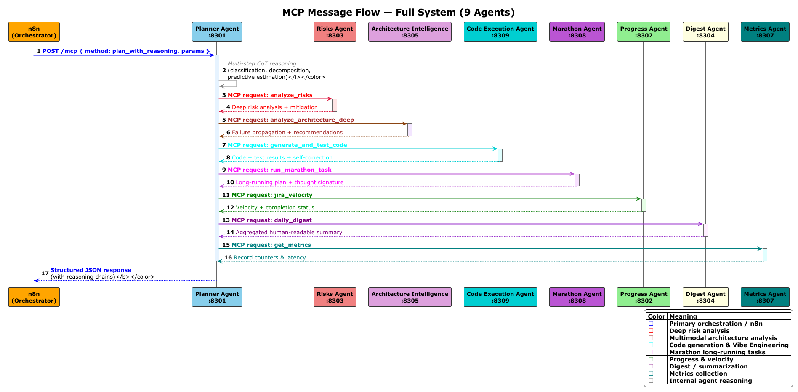

= Multi-Agent DevOps

:toc:
:toclevels: 3
:icons: font
:sectanchors:
:sectlinks:

A multi-agent intelligent system designed to automate DevOps team tasks,
powered by **Google Gemini API** and orchestrated through **n8n**.



Built for the **Gemini 3 Hackathon** — implements **Marathon Agent** and **Vibe Engineering** tracks.

====
== Badges

image:https://img.shields.io/badge/License-MIT-yellow.svg[License: MIT,link=https://opensource.org/licenses/MIT]
image:https://img.shields.io/badge/python-3.12-yellow.svg[Python 3.12,link=https://www.python.org/downloads/]
image:https://img.shields.io/badge/docker-required-blue.svg[Docker,link=https://www.docker.com/]
image:https://img.shields.io/badge/Jira-tracking-blue.svg[Jira,link=https://www.atlassian.com/software/jira]
image:https://img.shields.io/badge/Gemini-3-blue.svg[Gemini 3,link=https://deepmind.google/technologies/gemini/]
image:https://img.shields.io/badge/FastAPI-framework-green.svg[FastAPI,link=https://fastapi.tiangolo.com/]
image:https://img.shields.io/badge/n8n-automation-orange.svg[n8n,link=https://n8n.io/]

====

== Table of Contents

* <<project-overview,Project Overview>>
* <<system-architecture,System Architecture>>
** <<agent-overview,Agent Overview>>
** <<architecture-diagram,General Architecture Diagram>>
** <<pipeline,Request Processing Pipeline>>
** <<mcp-interaction,MCP Interaction Between Agents>>
* <<hackathon-tracks,Hackathon Track Alignment>>
* <<agent-architecture,Agent Architecture>>
* <<quick-start,Quick Start>>
** <<prerequisites,Prerequisites>>
** <<installation,Installation>>
* <<gemini-integration,Gemini Integration>>
** <<text-agents,Text Agents>>
** <<vision-agent,Vision Agent>>
** <<advanced-features,Advanced Features>>
* <<example-use-case,Example Use Case>>
* <<demo-workflow,Demo Workflow>>
* <<configuration,Configuration>>
* <<documentation,Documentation>>
* <<conclusion,Conclusion>>
* <<license,License>>
* <<team,Team>>

====

[[project-overview]]
== Project Overview

This system implements a multi-agent architecture featuring:

* 9 independent agents
* Google Gemini (text + vision + long context)
* MCP protocol for agent communication
* n8n orchestration with parallel & conditional workflows
* Multimodal architecture analysis with failure simulation
* Autonomous code generation & verification (Vibe Engineering)
* Long-running tasks with persistent state (Marathon Agent)
* Production-ready components (health checks, metrics, circuit breakers)

image::assets/AI_agents.png[Multi-Agent System Overview,width=900,align=center]

This project demonstrates how Gemini 3 can be used not as a single LLM call,
but as the cognitive core of a fully autonomous DevOps system capable of
long-running reasoning, self-correction, multimodal understanding, and
production-grade orchestration.

**Golden Standard Multi-Agent Design** All agents follow the gold standard of multi-agent systems: clear separation
of responsibilities, transparent reasoning chains, reproducible outputs, and graceful fallback with health
monitoring. This ensures reports are structured, auditable, and coach-ready.

====

[[system-architecture]]
== System Architecture

[[agent-overview]]
=== Agent Overview

[options="header"]
|===
| № | Agent                           | Port | Purpose                                             | Gemini Usage

| 1 | Planner Agent                   | 8301 | Strategic task decomposition, predictive estimation | Text + reasoning
| 2 | Progress Agent                  | 8302 | Velocity & completion tracking                      | Data analysis
| 3 | Risks Agent                     | 8303 | Deep security & compliance risk assessment          | Reasoning
| 4 | Digest Agent                    | 8304 | Human-readable report generation                    | Summarization
| 5 | Architecture Intelligence Agent | 8305 | Multimodal diagram analysis, failure propagation    | Vision + reasoning
| 6 | Health Monitor Agent            | 8306 | Health checks & resilience monitoring               | Status + anomaly detection
| 7 | Metrics Agent                   | 8307 | Prometheus metrics collection                       | Monitoring
| 8 | Marathon Agent                  | 8308 | Long-running tasks with self-correction & state persistence | Long context + CoT
| 9 | Code Execution Agent            | 8309 | Autonomous code generation, testing & debugging     | Reasoning + execution loops
|===

[[architecture-diagram]]
=== General Architecture Diagram



The diagram illustrates:
* n8n as central workflow orchestrator
* 9 independent MCP agents in Docker containers
* Gemini integration (text + vision + long context)
* Shared services: health monitoring, metrics, static assets
* Resilience: circuit breakers and health checks

[[pipeline]]
=== Request Processing Pipeline (n8n → agents)



This diagram shows the full end-to-end workflow:
* User trigger → n8n
* Planner coordinates parallel calls to specialized agents
* Aggregation and final digest
* Continuous health & metrics monitoring

[[mcp-interaction]]
=== MCP Interaction Between Agents



Each agent receives structured MCP requests and returns JSON with reasoning chains.
The Planner acts as coordinator, delegating to specialized agents (Risks, Architecture Intelligence, Code Execution, Marathon, etc.).

* **Marathon Agent Track** — Long-running tasks with persistent state,
  self-correction, and Thought Signatures.
* **Vibe Engineering Track** — Autonomous code generation, execution,
  testing, and debugging without human intervention.

====


[[agent-architecture]]
== 🎨 Agent Architecture

All agents are implemented as independent microservices:

* FastAPI
* Separate Docker container
* `/health` endpoint
* `/mcp` endpoint for tool calls
* Structured logging
* Unified MCP message schema
* ReasoningStep tracing

====

[[quick-start]]
== Quick Start

[[prerequisites]]
=== Prerequisites

* Docker & Docker Compose
* Google Gemini API key
* Linux / macOS / WSL

[[installation]]
=== Installation

. Clone repository
+
[source,bash]
----
git clone https://github.com/Exsellent/Multi-Agent-DevOps-Gemini
cd multi-agent-devops
----

. Configure environment
+
[source,bash]
----
cp .env.example .env
----

. Start system
+
[source,bash]
----
docker compose up --build
----

. Open n8n
+
http://localhost:5679

**Try it:**
[source,bash]

----
# Open browser
open http://localhost:8001
----

[[gemini-integration]]
== Gemini Integration

[[text-agents]]
=== Text Agents

All reasoning agents use **Gemini** for planning, risk analysis, code generation, and long-running tasks.

[[vision-agent]]
=== Vision Agent

Architecture Intelligence Agent uses Gemini Vision for:
* Deep diagram understanding
* Failure propagation simulation
* Architectural refactoring recommendations

[[advanced-features]]
=== Advanced Features

* **Marathon Agent**: Persistent Thought Signatures for tasks spanning hours/days
* **Code Execution Agent**: Autonomous testing loops and self-correction (Vibe Engineering track)


[[example-use-case]]
== Example Use Case
```text
A DevOps engineer submits an architecture diagram and a high-level request:
"Assess security risks and propose improvements."

The system autonomously:
* Analyzes the diagram (Vision)
* Identifies failure and security risks
* Generates refactoring suggestions
* Verifies proposed changes via code execution
* Produces a concise, human-readable report
```
====

[[demo-workflow]]
== Demo Workflow

[source]
----
User
  ↓
n8n Orchestrator
  ├─ Planner Agent (coordination + predictive planning)
  ├─ Risks Agent (deep security audit)
  ├─ Architecture Intelligence Agent (multimodal analysis)
  ├─ Code Execution Agent (autonomous code gen + testing)
  ├─ Marathon Agent (long-running validation)
  ├─ Progress Agent (velocity tracking)
  ├─ Digest Agent (final summary)
  ├─ Metrics Agent (observability)
  └─ Health Monitor (background resilience)
----

====

[[configuration]]
== Configuration

[source,bash]
----
LLM_PROVIDER=gemini
GEMINI_API_KEY=your_key
GEMINI_MODEL=gemini-3

VISION_PROVIDER=gemini
VISION_MODEL=gemini-3
----

====

[[documentation]]
== Documentation

* docs/AGENT_INTERACTIONS.md
* docs/diagrams/ (PlantUML sources)
* Swagger UI at `/docs` for each agent

====

[[conclusion]]
== Conclusion

The implementation follows modern DevOps and AI engineering practices:

[options="header"]
|===
| Key advantages

| Alert Fatigue Prevention
| Observability-First Design
| On-Demand Deep Analysis
| Production-Ready Architecture
| Autonomous Code Verification (Vibe Engineering)
| Long-Running Intelligent Tasks (Marathon Agent)
| Full Gemini Capabilities (text + vision + long context)
| Easy Reproducibility & Scaling
|===

=== Real-World Impact

This system targets real DevOps pain points observed in production teams:

* Reduces manual architecture and risk review time
* Enables autonomous analysis of complex system designs
* Supports long-running engineering workflows without human supervision
* Scales from single-team usage to organization-wide automation

The architecture is designed for real infrastructure, not one-off demos.


[[license]]
== License

MIT License


[[team]]
== Team

**Tatiana Hlazkina** — AI & Backend Engineer
📧 tatiana.adlock@gmail.com
🔗 https://github.com/Exsellent/

---

Built with ❤️ for the Gemini 3 Hackathon